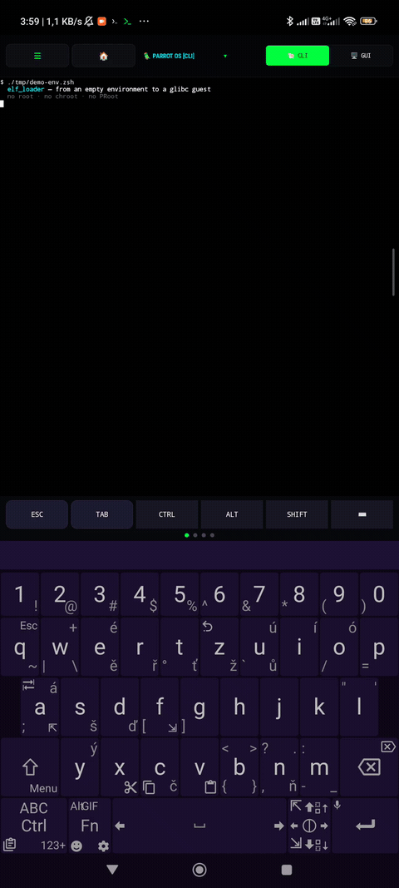

# elf_loader — run glibc Linux binaries on Android without root

**One loader, two userspaces.** elf_loader runs glibc binaries (Parrot / Debian
/ Ubuntu rootfs) directly on Android (bionic), in the same process — **without
proot, without chroot, without QEMU**. It maps the guest `libc.so.6` and its
dependencies into a private scope, applies relocations, and jumps to the guest
entry point.

Same kernel (Android), two userspaces: the bionic host and a glibc guest from a
rootfs.

```console
$ uname -srm
Linux 4.14.190-perf aarch64          # Android kernel, bionic host
$ cat /etc/os-release
cat: /etc/os-release: No such file or directory
$ lx cat /etc/os-release
PRETTY_NAME="Parrot Security 7.4 (echo)"
$ lx gcc hello.c -o hello && lx ./hello
hello from glibc, 42
```



**[▶ Watch the full 94-second demo](https://cdn.jsdelivr.net/gh/zombiegirlcz/elf_loader@master/docs/media/demo-env.mp4)**
— starts in an empty environment (`env -i`), sets up the paths, then runs
starship, python, uv, node and an interactive zsh. Reproduce it with
[`tools/demo-env.zsh`](tools/demo-env.zsh).

## Highlights

- **No root, no proot, no chroot** — plain non-root own-loading.
- **Works where proot struggles** — a seccomp compat filter emulates syscalls
  that Android's app profile (kernel 4.14) kills, so glibc's legacy fallbacks
  work.
- **Real toolchains** — `gcc` (with `ld`/`as` via a guest `PATH`), `python3`,
  `uv`, `git`, `gh`, `fzf`, Node.js, `tmux`, and a full interactive zsh with a
  starship prompt.
- **Any rootfs, any app** — everything is driven by environment variables, no
  hard-coded paths.

## Quick start

```sh
export D=$HOME                          # app files dir (= HOME)
export ROOTFS=$D/nh/distro/parrot       # guest rootfs
export R=$ROOTFS
export L=$D/usr/bin/elf_loader          # the loader binary

# one eval gives you the whole `lx` environment (lx, lxwhich, help, ...)
eval "$($L init zsh)"                   # or: eval "$($L init bash)"

lx cat /etc/os-release                  # runs the guest cat
lx python3 -c 'import sys; print(sys.version)'
lx gcc hello.c -o hello && lx ./hello   # compile + run inside the guest
```

`init zsh|bash` follows the same shell-integration pattern as
`starship init zsh` / `zoxide init zsh`. It derives everything from
`$HOME`/`$ROOTFS`:

| variable | meaning | default |
|---|---|---|
| `D` | app files dir | `$HOME` |
| `ROOTFS` | guest rootfs | `$D/nh/distro/parrot` |
| `R` | alias for `ROOTFS` | `$ROOTFS` |
| `L` | loader binary | `$D/usr/bin/elf_loader` |
| `LX_LOG` | log directory | `$HOME/.cache/lx` |
| `LOCPATH` | guest locale dir (only if it exists) | `$ROOTFS/usr/lib/locale` |
| `LC_ALL` | locale | `C.UTF-8` |

Overridable from outside: `ROOTFS=/other/rootfs zsh`.

### Shell helpers

| command | description |
|---|---|
| `lx <cmd> [args]` | run a guest binary under the loader (searches `LX_PATH`) |
| `lxwhich <cmd>` | show the full path of a guest binary |
| `lxq <cmd>` | like `lx`, but filters `[MMAP]` noise on stderr |
| `lxdbg VAR=1 <cmd>` | run with a loader debug variable |
| `lxhelper <.so> <cmd>` | run with a custom glibc helper library |
| `lxlog <cmd>` | run with output to a log, show the tail and exit code |
| `lxdiag [-c]` | loader `diag.txt` (SIGSYS/INIT traces); `-c` clears it |
| `lxinfo` | loader size/date, rootfs, repo branch |
| `lxfault <cmd>` | print only crash lines (FAULT, pc in, SIGSYS) |
| `lxtest` | regression set (echo, bash, python, node, bun, tmux, ...) |
| `help [topic]` (alias `lxhelp`) | built-in help with examples |
| `<unknown command>` | auto-found in the rootfs and run via the loader |

`lx` passes a guest `PATH` (paths inside the rootfs), so tools that spawn
helpers by name (e.g. `gcc` looking for `ld`/`as`) work.

## CLI

```
elf_loader --help | -h
elf_loader --version | -V
elf_loader --check <file>
elf_loader [--lazy] --run   <elf> [args..]     host-loader mode (host libc)
elf_loader [--lazy] --own   <elf> <shared.so>  own-load one shared module
elf_loader [--lazy] --ownall <elf> [args..]    own-load all deps (guest glibc)
elf_loader [--lazy] --shim  <elf> [args..]     F2 path-translation shim
elf_loader init zsh|bash                        print eval-able shell env
elf_loader <elf>                                introspect (no execution)
```

## How it works

Five mechanisms make same-process glibc-on-bionic possible: own-loading (no
`dlopen`), IFUNC/IRELATIVE resolution, a private heap arena to keep the two
`malloc`s off each other's `brk`, static TLS with a guest thread pointer, and a
seccomp compat filter. Full write-up: [`docs/how-it-works.md`](docs/how-it-works.md).

## Verified

| binary / stack | status |
|---|---|
| coreutils, `grep`, `sed`, `awk`, `find`, … | ✅ |
| `python3` (glibc 2.41), `uv` | ✅ |
| `gcc` 14 (compiles + runs C in the guest) | ✅ |
| `git`, `gh`, `glab`, `git-lfs`, `fzf` (Go/cgo mode) | ✅ |
| Node.js ≤ 22 (LTS) | ✅ |
| Node.js 26 | ✅ (recently fixed — see [Known issues](#known-issues--help-wanted)) |
| `tmux` (guest glibc, bionic zsh shell) | ✅ |
| Bun (`claude.exe`) | ✅ |

Regression suite: `test-all.sh` — see [Testing](#testing).

## Known issues / help wanted

This project is developed against a small number of devices, so **bug reports
from other hardware are the main way it improves**. If something misbehaves,
please open an issue — there are templates for bug reports and "it works"
reports.

Open / under investigation:

- **Node.js ≥ 23 / v26** — a `JSDispatchTable` bootstrap nondeterminism in V8
  caused intermittent SIGSEGV. Node 22 is rock-solid; Node 26 now starts but
  is still being shaken out. Needs testing across Node 23/24/25/26 and V8
  versions.
- **Network binaries** (`nmap`, `starship`-adjacent tools) — occasional SIGSEGV
  under the bionic host.
- **16 KB page size** (Android 15+) — needs a real device to verify.
- Intermittent ~5 % SIGSEGV in helper libraries (heap fix in progress).

Help especially wanted with: **testing on different devices / Android versions
/ kernels**, reproducing crashes, and reports of which guest binaries work.

## Testing

```sh
./test-all.sh all            # every category
./test-all.sh python         # python smoke tests
./test-all.sh uv symlink fstat nss   # individual regressions
```

Runs through an `ashell`-style device shell; `PASS` / `FLAKY` / `FAIL` / `SKIP`
per case. Latest full run: **PASS 160 / FAIL 0**.

## Build

Cross-compiled with the Android NDK via GitHub Actions (workflow
`build-elf-loader`):

```sh
tools/gh_build_deploy.sh          # build HEAD, download, deploy to device
tools/gh_build_deploy.sh --push   # push first
```

Or locally with the NDK:

```sh
TC=/opt/android-ndk-r28/toolchains/llvm/prebuilt/linux-x86_64/bin
$TC/aarch64-linux-android24-clang -Wall -Wextra -g -O0 -std=c11 \
    src/main.c src/elf_loader.c src/ldso_tls.c src/entry.S -ldl -o elf_loader_ndk
```

The result is a bionic binary with `PT_INTERP /system/bin/linker64`.

## Repo layout

| path | purpose |
|---|---|
| `src/elf_loader.c`, `src/main.c`, `src/entry.S`, `include/elf_loader.h` | the loader |
| `gbsh/gbsh.c` | native bionic interactive shell |
| `tools/elroot.sh` | proot-like launcher over elf_loader + gbsh |
| `tools/demo-env.zsh` | scripted demo (env -i → glibc guest) |
| `magisk-module/` | Magisk module (universal rootfs detection, bundles a bionic-native zsh host shell — `bzsh`) |
| `docs/` | English docs |
| `postup.md` | full development diary (Czech) |

## License

See the repository. Contributions and bug reports welcome.